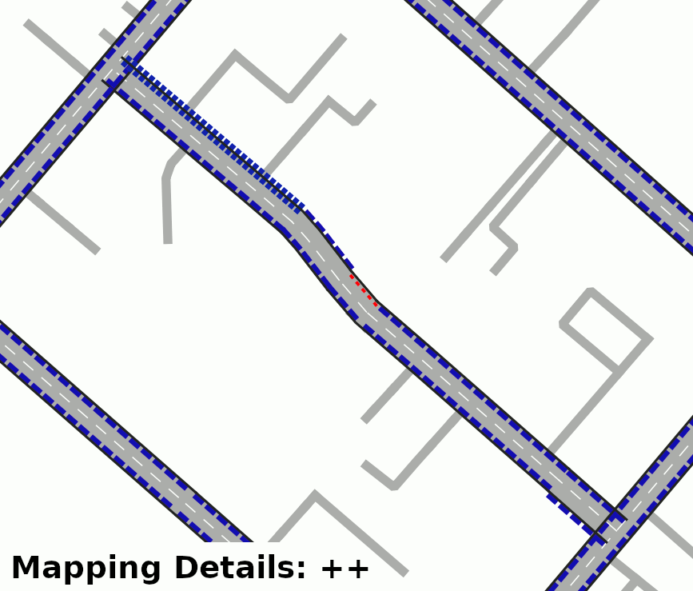

## Zusammenfassung
{: class='mt-5 mb-3' }

OSM-Daten ermöglichen die Berechnung von Parkplätzen im Straßenraum, wenn Parkstreifen und einige andere räumliche Features erfasst sind. Die Genauigkeit solcher Berechnungen hängt davon ab, wie vollständig und detailliert die Parkstreifen und räumlichen Features erfasst sind. Mit Modellrechnungen zeigen wir am Beispiel des Berliner Ortsteils Neukölln, dass bereits eine eher grob differenzierte Parkraumkartierung ausreicht, um Ergebnisse im Bereich von 5-10 Prozent Genauigkeit zu erhalten. Dazu gehört die Erfassung längerer Parkstreifenwechsel oder Parkverbote ab einer Länge von etwa 25 Metern sowie die Erfassung der wichtigsten räumlichen Features, vor allem Einfahrten, Bushaltestellen und Parkbuchten. Bei Bedarf gibt es darüber hinaus aber zahlreiche weitere Stellschrauben, die vergleichsweise arbeitsaufwendig sind, aber das Ergebnis perfektionieren.

---

## Einführung
{: class='mt-5 mb-3' }

Im März 2021 haben wir gezeigt, wie man [Parkplatzzählungen und Parkraumanalysen auf Basis von OSM-Daten](https://parkraum.osm-verkehrswende.org/posts/2021-03-12-parkraumanalyse) durchführen kann. Daten über Parkplätze im öffentlichen Raum sind eine wichtige Grundlage für die Verkehrs- und Stadtplanung – gerade angesichts der aktuellen Verkehrswende. Sie sind aber nur an sehr wenigen Orten verfügbar. Mit OSM-Daten könnte sich das ändern.

Bei der Erarbeitung unserer Methode haben wir festgestellt, dass sie sehr genaue Ergebnisse liefern kann, wenn die Datengrundlagen präzise kartiert sind. Zu den notwendigen Daten gehören in erster Linie die Parkstreifen im öffentlichen Straßenraum – also ob entlang einer Straße Fahrzeuge parken dürfen und falls ja, in welche Richtung sie parken (z.B. parallel oder schräg zur Straße). 

Die von uns entwickelte Methode – das sogenannte „Subtraktive Modell“ – benutzt diese Daten, um die Anzahl der verfügbaren Stellplätze aus der Straßengeometrie abzuleiten. In der Realität gibt es jedoch viele Umstände, die das Parken entlang einer Straße einschränken: Nicht nur Kreuzungen, sondern z.B. auch Bushaltestellen, Ampeln oder Einfahrten. Auch solche Faktoren können in OSM kartographisch erfasst werden. Unser Subtraktives Modell bezieht diese Daten mit ein und zieht entsprechende Bereiche, in denen nicht geparkt werden kann, von den Daten ab.

Vor diesem Hintergrund haben wir uns schon lange die Frage gestellt, welche Faktoren das Ergebnis der Parkplatzzählung am stärksten beeinflussen. Was muss ich also mappen, um am Ende zuverlässige Stellplatzzahlen berechnen zu können? Welche Daten sind am wichtigsten, um eine hohe Genauigkeit zu erreichen und welche Daten sind vielleicht eher verzichtbar? Mit welcher Abweichung muss ich im Vergleich zur Realität rechnen?

## Methodisches Vorgehen
{: class='mt-5 mb-3' }

Um diese Fragen zu beantworten, haben wir in einem gut kartierten Testgebiet mit über 27.000 Stellplätzen einige Modellrechnungen angestellt und die Zahlen miteinander verglichen. Ideal geeignet ist dafür der Berliner Ortsteil Neukölln, den wir während der Entwicklung unserer Methode detailliert kartiert und die berechneten Ergebnisse durch Zählungen vor Ort mit der Realität abgeglichen haben (siehe auch [Methodenbericht zur Neuköllner Parkraumanalyse](https://parkraum.osm-verkehrswende.org/project-prototype-neukoelln/report)). Die Datenberechnung ist in QGIS über ein [Python-Script](https://github.com/SupaplexOSM/strassenraumkarte-neukoelln/tree/main/scripts/parking_lanes) möglich: Wenn wir einzelne Elemente in diesem Script verändern oder weglassen, lässt sich also ihr Einfluss auf das Ergebnis bestimmen.

Ein einfaches Beispiel: Wie würde sich das Ergebnis verändern, wenn wir keine Einfahrten kartiert hätten? Statt vor jeder Einfahrt einen vier Meter großen Bereich freizuhalten, überspringen wir diesen Rechenschritt und erhalten ein Ergebnis ohne Einfahrten, das wir mit dem „echten“ Ergebnis vergleichen können. Die Abweichung zwischen beiden Ergebnissen entspricht dem Einfluss von Einfahrten auf das Gesamtergebnis.

## Berücksichtigte Faktoren
{: class='mt-5 mb-3' }

Zu den untersuchten Faktoren gehören die wichtigsten **baulichen Merkmale („räumliche Features“)**, die das Parken (entsprechend der deutschen Straßenverkehrsordnung) auf folgende Art und Weise beeinflussen:

- Einfahrten (vor Einfahrten muss ein Bereich zum Ein- und Ausfahren freigehalten werden).

- Ampeln bzw. an Haltelinien in OSM separat erfasste individuelle Ampelstandorte (je nach Auslegung der Straßenverkehrsordnung müssen zehn Meter vor einer Ampel freigehalten werden, um die Sicht auf die Ampel nicht zu beeinträchtigen).

- Zebrastreifen und Fußgängerampeln (auf und vor markierten Querungsstellen darf nicht geparkt werden, um das Queren und Sicht auf Fußgänger nicht zu beeinträchtigen).    

- baulich angelegte Querungsstellen (Gehwegvorstreckungen, randseitige Markierungen oder andere Schutzelemente können das Parken an Querungsstellen einschränken, um die Verkehrssicherheit zu erhöhen).

- Bushaltestellen (15 Meter vor und hinter einem Bushaltestellenschild darf nicht geparkt werden, um die Zufahrt zur Haltestelle zu ermöglichen).

- Anlagen im Fahrbahnbereich (in Berlin werden zunehmend Fahrradständer oder auch Parklets auf früheren Parkstreifen errichtet, um die Verkehrssicherheit oder Aufenthaltsqualität zu erhöhen).

Darüber hinaus wurde der Einfluss von bestimmten **Mapping-Praktiken und -Szenarien** ermittelt:

(a) Welchen Einfluss hat es, ob Parkbuchten als separate Geometrien erfasst werden oder schlicht an der Straßenlinie? Da Parkbuchten baulich oft etwas kleinteiliger differenziert sind – z.B. durch Zwischenräume für Straßenbäume – können ihre Geometrien mit der separaten Kartierweise detaillierter abgebildet werden.     

(b) Wie verändert sich das Ergebnis in Abhängigkeit vom Detailgrad der erfassten Parkstreifen, also ob die Parkstreifen sehr kleinteilig differenziert, eher grob oder nur sehr oberflächlich kartiert sind? Dafür wurde der in hoher Genauigkeit vorliegende Parkstreifendatensatz im Testgebiet manuell in zwei Stufen „vereinfacht“, um in Modellrechnungen mögliche Mapping-Praktiken widerzuspiegeln (siehe beispielhaft die untenstehende Abbildung):

- Bei nicht differenzierten Parkstreifen ist entlang eines Straßenabschnitts (z.B. zwischen zwei Kreuzungen) nur die vorherrschende Parkform erfasst. Vorübergehende Ausrichtungswechsel, Parkverbote etc. entlang dieses Abschnitts werden ignoriert. Diese Form der Erfassung ist relativ zügig beispielsweise über Luftbilder möglich. Die Straßenlinien müssen dafür in OSM nur selten aufgetrennt werden.

- Grob differenzierte Parkstreifen berücksichtigen signifikante Wechsel in der Parkform (ab einer Länge von etwa 25 Metern entlang eines Straßenabschnitts), z.B. Park- oder Halteverbote oder vorübergehende Änderungen in der Ausrichtung oder Position der Fahrzeuge. Auch das ist oft über Luftbilder möglich, eine gute Unterstützung bieten aber auch Straßenfotos oder Vor-Ort-Erhebungen. In OSM ist es dafür regelmäßig das Auftrennen der Straßenlinie am Ort des Wechsels nötig.

- Kleinteilig differenzierte Parkstreifen enthalten darüber hinaus auch recht kurze Wechsel in der Parkform, die im Einzelnen nur wenige Fahrzeuge betreffen bzw. sich nur auf einen kurzen Bereich erstrecken (etwa 5 – 25 Meter). Diese Form der Erfassung ist zuverlässig nur vor Ort oder durch 360-Grad-Straßenfotos möglich. Die Straßenlinien müssen oft aufgetrennt werden, was Nachteile in der späteren Datenpflege mit sich bringen kann.

{: class='img-thumbnail' }

(c) Darauf aufbauend: Mit welcher Ergebnisgenauigkeit ist insgesamt bei geringer, mittlerer oder hoher Datenqualität zu rechnen? Dafür wurden Mapping-Szenarien mit bestimmten Annahmen aufgestellt:

- Keine Daten vorhanden: Es gibt keine Daten zu Parkstreifen, diese werden einfach durch die Annahme ersetzt, dass beidseitig einer Straße parallel geparkt werden kann. Außerdem sind alle oben genannten räumlichen Features nicht erfasst.

- Geringe Datenqualität: Die Parkstreifen sind entlang aller Straßen sehr oberflächlich erfasst, die räumlichen Features sind jedoch nicht kartiert.

- Mittlere Datenqualität: Die Parkstreifen sind grob differenziert erfasst und die wichtigsten räumlichen Features (Zebrastreifen, Ampeln, Bushaltestellen, die Hälfte aller Einfahrten) sind vorhanden.

- Hohe Datenqualität: Die Parkstreifen sind grob differenziert erfasst und alle räumlichen Features sind vorhanden.

- Ein Szenario sehr hoher Datenqualität (mit kleinteilig differenzierten Parkstreifen und nahezu allen räumlichen Features) entspricht dem Kartierungsstand im Testgebiet und diente als Bewertungs-Referenz.

Schließlich wurde noch der Einfluss einzelner **Attribute an Straßen oder Parkflächen** untersucht:

- genau erfasste Fahrbahnbreite einer Straße (beeinflusst z.B. die Lage von Bordsteinkanten und deren Schnittpunkten im Kreuzungsbereich),

- Breite von Einfahrten, insbesondere bei überbreiten Einfahrten (beeinflusst die Länge des freigehaltenen Bereichs vor einer Einfahrt),

- Fahrzeugausrichtung und Stellplatzkapazität von separat kartierten Parkbuchten (wenn diese Attribute explizit erfasst sind, müssen sie nicht aus der Geometrie interpoliert werden).

## Ergebnisse
{: class='mt-5 mb-3' }

Aus den Modellrechnungen ergeben sich die folgenden wichtigsten Aussagen (vgl. im Einzelnen die nachfolgende Tabelle):

- Kleinteilig differenziert kartierte Parkstreifen, die einen recht hohen Kartierungsaufwand bedeuten und mit einer hohen Fragmentierung (und damit verbundenen Nachteilen in der Datenpflege) von Straßensegmenten in der OSM-Datenbank einhergehen, bringen insgesamt nur eine kleine Verbesserung von etwa drei Prozent des Ergebnisses – wenn man davon ausgeht, dass andere räumliche Features in hoher Genauigkeit und Vollständigkeit erfasst sind. Für allgemeine Grundaussagen zu Stellplatzzahlen ist eine grobe Differenzierung der Parkstreifen also ausreichend, wobei die systematische Überschätzung des Ergebnisses berücksichtigt und ggf. abgezogen werden sollte (siehe unten).

- Insbesondere bei Straßenabschnitten mit Schräg- oder Querparken – bei denen vergleichsweise viele Fahrzeuge pro Länge eines Straßensegments parken – kann sich aber eine feinere Differenzierung lohnen[^1] und sollte auch auf die möglichst vollständige Erfassung räumlicher Features Wert gelegt werden, um Fehler entlang dieser Segmente zu vermeiden.

- Als wichtigste räumliche Features, die den größten Einfluss auf die Genauigkeit der Ergebnisse haben, haben sich Einfahrten (über 5 %) und Bushaltestellen (etwa 1 %) herausgestellt. Da Bushaltestellen wohl meist bereits gut erfasst sind, sollten also vor allem Einfahrten im Fokus von Mapping-Kampagnen zur Durchführung von Parkraumanalysen stehen.

- Alle anderen räumlichen Features haben – jeweils für sich gesehen – nur einen kleinen Einfluss auf das Ergebnis (< 1 %). In der Summe dieser Features (außer Einfahrten und Bushaltestellen) ergibt sich lediglich eine Abweichung von etwa drei Prozent. Je nach ortsüblicher baulicher Situation bzw. realen Häufigkeit solcher Features können diese anderenorts aber auch relevanter sein (siehe unten).

- Die separate Erfassung von Parkbuchten verbessert das Ergebnis signifikant. Vor allem in Gebieten, in denen Parkbuchten häufiger vorkommen und sich durch bauliche Differenzierung (z.B. Zwischenräume für Straßenbäume) auszeichnen, sollten diese separat erfasst werden, um das Ergebnis nicht zu verfälschen.

[^1]: Eine genaue Erfassung von Parkbeschränkungen (temporäre Parkverbote, Ladezonen, Stellplätze für mobilitätseingeschränkte Personen etc.) sind ohne kleinteilig differenzierte Parkstreifen ebenfalls oft schwer umzusetzen.

## Wie repräsentativ sind diese Testergebnisse?
{: class='mt-5 mb-3' }

Üblicherweise führen fehlende oder ungenaue Daten mit der Methode des Subtraktiven Modells **zu einer Erhöhung** der interpolierten Stellplatzzahlen (“Überschätzung”), da Bereiche, in denen nicht geparkt werden kann, dann nicht subtrahiert werden. Je nach Datenqualität kann man diesen systematischen Fehler abschätzen (oder stichprobenhaft prüfen) und dies bei der Ergebnisbewertung berücksichtigen. Wird mit dem Subtraktiven Modell auf Basis einer „mittleren Datenqualität“ (vgl. Tabelle) beispielsweise eine bestimmte Stellplatzzahl für einen Stadtteil ermittelt, wird die tatsächliche Stellplatzzahl wahrscheinlich etwa in einer Größenordnung von 10% darunter liegen. Selbst bei sehr präziser Datenqualität bleibt stets eine Ungenauigkeit, die sich bei Tests in Neukölln im Bereich von unter einem bis zwei Prozent[^2] beläuft – was jedoch, zumindest in Berlin, weit unterhalb der „realen Abweichungen“ z.B. durch Falschparker oder Baustellen liegt (vgl. auch den [Methodenbericht zur Parkraumanalyse](https://parkraum.osm-verkehrswende.org/project-prototype-neukoelln/report)).

Generell ist zu beachten, dass sich die genannten Aussagen zur Datengenauigkeit auf die mittleren Abweichungen innerhalb eines (größeren) Gebiets beziehen. Aussagen über Stellplätze z.B. in einem Stadtteil sind also relativ zuverlässig möglich, bei Einzelfallaussagen (z.B. Stellplätze entlang eines Straßensegments) können hingegen – je nach Bedingungen vor Ort und Qualität der Daten (z.B. Schräg- oder Querparken, nicht exakt erfasste Wechsel von Parkstreifeneigenschaften, ungenau erfasste Parkbuchten…) – möglicherweise größere Abweichungen zur Realität entstehen.

[^2]: Vergleichsgrundlage ist stets die nicht-ordnungswidrige Parksituation, also die Anzahl der Stellplätze, die es an einem Ort gibt, wenn alle juristischen Vorgaben (insbesondere die Straßenverkehrsordnung) eingehalten werden (würden). Allein bei der Auslegung dieser Regeln gibt es signifikante Grauzonen und Unsicherheiten.

## Zusammengefasst lässt sich festhalten:
{: class='mt-5 mb-3' }

Ein sehr detailliertes, aufwendiges Parkstreifenmapping ist nicht notwendig, um aussagekräftige Stellplatzzahlen zu ermitteln, solange signifikante Parkstreifenänderungen erfasst werden und die systematische Unsicherheit in der Interpretation der Ergebnisse berücksichtigt wird. Abseits der Parkstreifen sollte versucht werden, ortsübliche/ charakteristische bauliche Merkmale möglichst vollständig und genau zu erfassen – im Testgebiet zählen dazu vor allem Einfahrten, in einigen Quartieren aber auch Parkbuchten oder häufige Gehwegvorstreckungen. An anderen Orten können andere Faktoren maßgeblichen Einfluss auf die Ergebnisqualität haben, beispielsweise häufige Hindernisse auf Parkstreifenflächen oder beim Gehwegparken (wie Bäume oder Straßenlaternen), die das Modell bisher (noch) nicht automatisiert verarbeiten kann.

---

## Fußnoten
{: class='mt-5 mb-3' }
